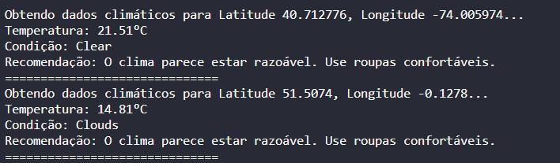

# 🌤 Weather ETL Pipeline em Python
Este é um exemplo de um script Python que realiza uma ETL (Extração, Transformação e Carga) de dados climáticos usando a API OpenWeatherMap. A ETL é uma abordagem para coletar, transformar e carregar dados de diferentes fontes para um destino específico, como um banco de dados ou um armazenamento de dados.

## Como Funciona
### ✉ 1. Carregamento dos Dados: 
O script lê os dados das cidades e suas coordenadas de latitude e longitude a partir do arquivo **cities.csv**. Cada linha do arquivo contém as coordenadas de uma cidade.

### 📨 2. Obtenção dos Dados Climáticos:
 Para cada cidade no arquivo, o script utiliza a API OpenWeatherMap para obter dados climáticos em tempo real. Ele faz uma chamada à API usando as coordenadas da cidade e a chave de API do OpenWeatherMap.

### 📧 3. Transformação dos Dados: 
 Os dados climáticos obtidos são transformados para extrair informações como temperatura atual e condição climática. Uma função de recomendação é aplicada para sugerir ações com base nas condições climáticas.

### 📩 4. Exibição dos Resultados:
 O script imprime na saída padrão as informações climáticas, a recomendação e os detalhes da cidade para cada registro.

## 📌 Requisitos
Python 3.x
Chave de API do OpenWeatherMap

## 📚 Como Usar
Certifique-se de ter o Python instalado em sua máquina.

Clone este repositório ou faça o download dos arquivos.

Instale as bibliotecas necessárias executando `pip install panda` e `pip install requests`.

Crie uma conta no [OpenWeatherMap](https://openweathermap.org/)
 para obter uma chave de API.

Crie um arquivo chamado cities.csv no mesmo diretório do arquivo Python. Preencha-o com as coordenadas de latitude e longitude das cidades que você deseja obter dados climáticos.

Substitua **"SUA_CHAVE_DE_API_DO_OPENWEATHERMAP"** na variável **api_key** pelo sua chave de API do OpenWeatherMap.

Execute o script **weather_etl.py** usando o Python.

## 🚩 Notas
Certifique-se de ter uma conexão à internet para fazer as chamadas à API.

Este é um exemplo simplificado de uma pipeline ETL. Em cenários reais, a transformação de dados e a carga podem ser mais complexas.

## ✒️ Autores

- **Gabriel Barros** -  [*Vamos se conectar!*](https://github.com/gabrielsmp)
---
⌨️ com ❤️ por [Gabriel Barros](https://www.linkedin.com/in/gabrielbarrosdasilva/) 😊